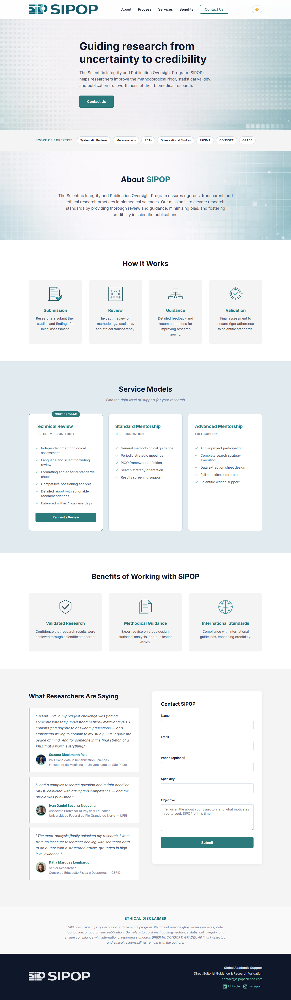
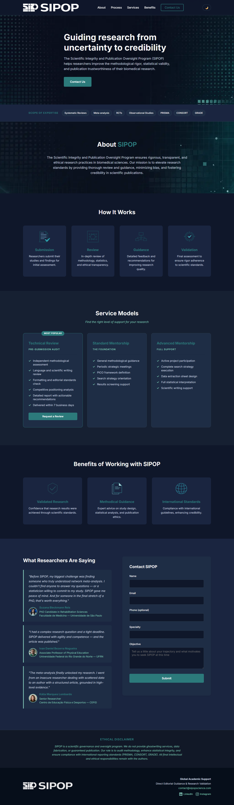

# SIPOP — Scientific Integrity and Publication Oversight Program

> **Scientific Rigor for Global Impact**

Institutional website for SIPOP, a program offering methodological auditing, technical review, and high-level mentorship for researchers aiming at global scientific publication.

---

## Screenshots

### Light Mode


### Dark Mode


---

## About the Project

SIPOP is a one-page institutional website built from the ground up, including brand identity, visual design, and front-end development. The project encompasses:

- Full brand identity (logo, color palette, typography, visual system)
- Canva template pack (10 templates for Instagram and LinkedIn)
- Social media content strategy and copywriting
- Paid ad campaigns (Instagram carousels)
- Website design and development

---

## Tech Stack

- **HTML5** — semantic structure
- **CSS3** — custom properties, CSS variables for theming, responsive grid
- **Vanilla JavaScript** — no frameworks or dependencies
- **Google Apps Script** — serverless form handling, data stored in Google Sheets
- **Google Fonts** — Inter typeface

---

## Features

- ✅ Fully responsive (mobile-first)
- ✅ Three-state theme toggle: light / dark / system preference
- ✅ Contact form connected to Google Sheets via Apps Script
- ✅ Email notifications on form submission via MailApp
- ✅ Smooth scroll navigation
- ✅ Background images swap between light/dark versions
- ✅ Semantic HTML with `aria-label` and `aria-live` attributes
- ✅ No external JS dependencies

---

## Brand

| Token | Value |
|---|---|
| Pine Blue | `#2C7A7B` |
| Pearl Aqua | `#81C7B7` |
| White Smoke | `#F4F4F4` |
| Pale Slate | `#CBD5E0` |
| Slate Black | `#0F172A` |
| Typeface | Inter (Google Fonts) |

---

## File Structure

```
sipop/
├── index.html              # Main HTML — structure and content
├── style.css               # All styles, CSS variables, theming, responsive
├── script.js               # Theme toggle, form handler, scroll behavior
├── apps-script.gs          # Google Apps Script — paste into Apps Script editor
├── README.md
│
├── assets/
│   ├── images/
│   │   ├── backgrounds/    # BG1, BG1DM, BG2, BG2DM (.webp)
│   │   ├── icons/          # Icon1–Icon7 (.webp)
│   │   ├── logo/           # Logo1, Logo2 (.webp)
│   │   ├── favicon/        # Icon.ico
│   │   └── testimonials/   # suzana, ivan, katia (.webp)
│   │
│   └── design/             # Source files — not deployed
│       ├── icons-source/   # .ai originals
│       └── backgrounds/    # .png originals
│
└── screenshots/
    ├── light.png           # Full-page screenshot — light mode
    └── dark.png            # Full-page screenshot — dark mode
```

---

## Form Setup (Google Apps Script)

1. Open Google Sheets and create a new spreadsheet
2. Go to **Extensions > Apps Script** (or create a new project at script.google.com)
3. Paste the contents of `apps-script.gs`, replacing the existing code
4. Save and click **Deploy > New deployment**
   - Type: **Web App**
   - Execute as: **Me**
   - Who has access: **Anyone**
5. Authorize the app when prompted
6. Copy the generated URL
7. In `script.js`, replace `'COLE_A_URL_DO_APPS_SCRIPT_AQUI'` with the URL

Submissions are saved to a sheet tab named **"SIPOP Contacts"**, created automatically on the first submission. Email notifications are sent via `MailApp.sendEmail` — update the recipient addresses directly in `apps-script.gs`.

---

## Links

- 🌐 Website: [sipopscience.com](https://sipopscience.com)
- 💼 LinkedIn: [linkedin.com/company/sipop-science](https://www.linkedin.com/company/sipop-science/)
- 📷 Instagram: [instagram.com/sipopscience](https://www.instagram.com/sipopscience/)
- 📧 Contact: contact@sipopscience.com

---

## Development

**Design & Development:** Victor Leme  
**Client:** SIPOP / Gaspar Rogério da Silva Chiappa  
**Year:** 2025
