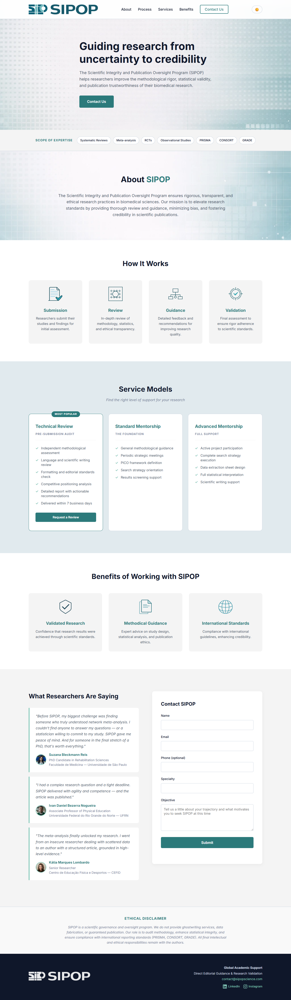
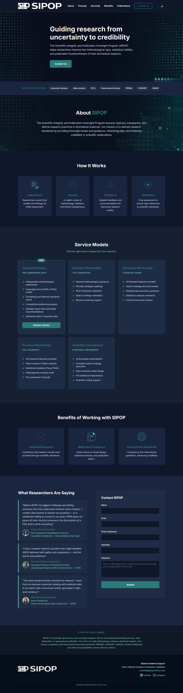
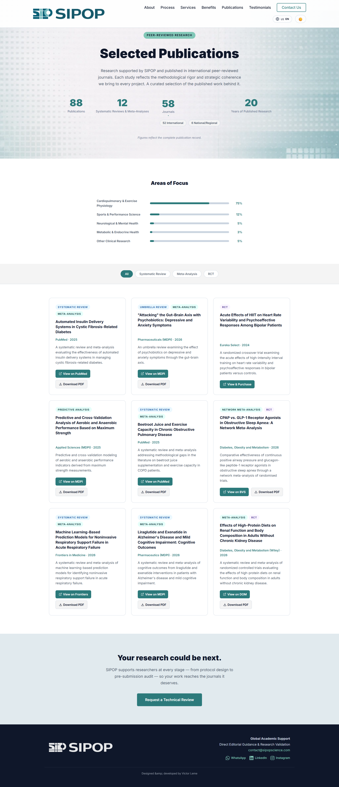
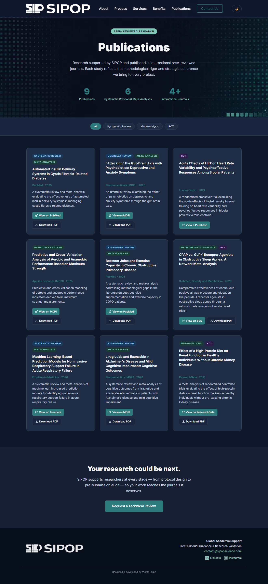
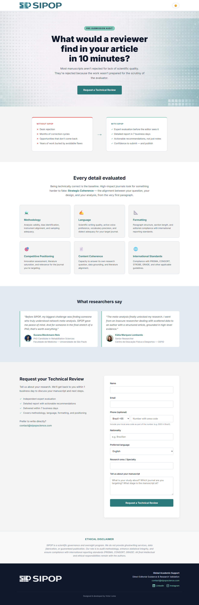
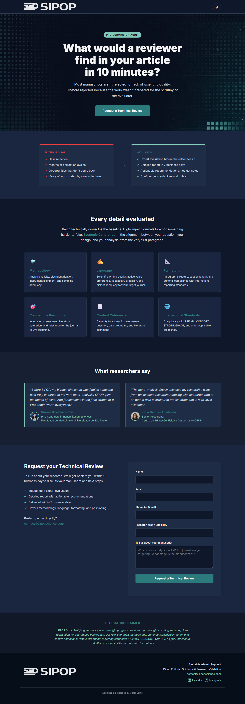

# SIPOP — Scientific Integrity and Publication Oversight Program

> **Scientific Rigor for Global Impact**

Institutional website for SIPOP, a program offering methodological auditing, technical review, and high-level mentorship for researchers aiming at global scientific publication.

Available in **English**, **Portuguese (pt-BR)**, and **Spanish**.

---

## Screenshots

### Home

| Light Mode | Dark Mode |
|---|---|
|  |  |

### Publications

| Light Mode | Dark Mode |
|---|---|
|  |  |

### Technical Review

| Light Mode | Dark Mode |
|---|---|
|  |  |

---

## About the Project

SIPOP is an institutional website built from the ground up, including brand identity, visual design, and front-end development. The project encompasses:

- Full brand identity (logo, color palette, typography, visual system)
- Canva template pack (10 templates for Instagram and LinkedIn)
- Social media content strategy and copywriting
- Paid ad campaigns (Instagram carousels)
- Website design and development
- Multilingual architecture (EN / PT-BR / ES), data-driven and built to scale to additional languages

---

## Tech Stack

- **Eleventy (11ty) v3** — static site generator with Nunjucks templating
- **Nunjucks (.njk)** — layouts, includes, macros, and page templates
- **HTML5** — semantic structure
- **CSS3** — custom properties, CSS variables for theming, responsive grid
- **Vanilla JavaScript** — no frameworks or dependencies
- **Google Apps Script** — serverless form handling, data stored in Google Sheets
- **Netlify** — build and hosting
- **Google Fonts** — Inter typeface

---

## Features

- ✅ Fully responsive (mobile-first)
- ✅ Three-state theme toggle: light / dark / system preference
- ✅ Multilingual: English, Portuguese (pt-BR), and Spanish, with a globe-icon language switcher (flag + code) in the header
- ✅ `hreflang` + `canonical` tags on every page for multilingual SEO
- ✅ Contact form connected to Google Sheets via Apps Script, with per-language labels, country codes, and nationality suggestions
- ✅ WhatsApp Business, LinkedIn, and Instagram contact links in the footer, with a pre-filled greeting message per language
- ✅ Email notifications on form submission via MailApp
- ✅ Smooth scroll navigation
- ✅ Background images swap between light/dark versions
- ✅ Semantic HTML with `aria-label` and `aria-live` attributes
- ✅ Multi-page, multi-language: Home, Publications, Technical Review, and Testimonials, each in 3 languages (12 routes total)
- ✅ No external JS dependencies

---

## Pages

Every page exists in three languages. English lives at the root; other languages live under a language-code subfolder (`/pt/`, `/es/`) — the internationally recognized pattern for multilingual SEO.

| Page | Template | English | Português | Español |
|---|---|---|---|---|
| Home | `src/index.njk` / `src/pt/index.njk` / `src/es/index.njk` | `/` | `/pt/` | `/es/` |
| Publications | `.../publications.njk` | `/publications` | `/pt/publications` | `/es/publications` |
| Technical Review | `.../technical-review.njk` | `/technical-review` | `/pt/technical-review` | `/es/technical-review` |
| Testimonials | `.../testimonials.njk` | `/testimonials` | `/pt/testimonials` | `/es/testimonials` |

---

## Internationalization (i18n)

The site uses a **data-driven i18n architecture**: page templates are written once and shared across all languages. Adding a language means adding data files — not touching `.njk` markup.

```
src/_data/
├── i18n/
│   ├── en.json          # all UI text — nav, footer, form, and every page's copy
│   ├── pt.json
│   └── es.json
├── publications.json    # the 9 publications — title/journal/abstract per language,
│                         # links and PDFs are language-independent
├── testimonials.json    # full testimonials list (name/org/role/quote per language,
│                         # plus category for the filter on /testimonials) — the Home
│                         # and Technical Review pages pull their own short quote sets
│                         # directly from i18n/{lang}.json instead
├── countryCodes.json    # phone country-code select, country names per language
└── nationalities.json   # nationality datalist, demonyms per language
```

**To edit existing text:** find the string in `src/_data/i18n/{lang}.json` (structured by section — `nav`, `footer`, `form`, `home`, `publications`, `technicalReview`, `testimonials`) and edit it directly. No rebuild logic needed beyond `npm run build`.

**To add a new language (e.g. French):**
1. Copy `src/_data/i18n/en.json` to `src/_data/i18n/fr.json` and translate every value (keep all keys identical).
2. Add an `"fr"` field to each entry in `countryCodes.json`, `nationalities.json`, and `publications.json`.
3. Create `src/fr/index.njk`, `src/fr/publications.njk`, and `src/fr/technical-review.njk`, copying the front matter from the equivalent `src/pt/*.njk` files and changing `lang: pt` to `lang: fr`.
4. Add the matching redirects to `netlify.toml` (see the `/pt/...` and `/es/...` blocks for the pattern).
5. Build. The language switcher, `hreflang` tags, and canonical URLs pick up the new language automatically — they loop over everything in `src/_data/i18n/`.

**Shared components** (contact form, publication card, testimonial card, language switcher) are Nunjucks macros in `src/_includes/macros.njk`, parameterized by the current language's text dictionary (`t`) and language code (`lang`) — written once, reused everywhere.

---

## File Structure

```
sipop/
├── .eleventy.js                 # Eleventy config — passthrough, dirs, engines
├── .eleventyignore               # Ignores node_modules and _site
├── .gitignore
├── netlify.toml                  # Build command, publish dir, clean URL redirects (EN/PT/ES)
├── package.json
├── apps-script.gs                # Google Apps Script — paste into Apps Script editor
├── README.md
│
├── src/                          # Eleventy input dir
│   ├── index.njk                 # Home (English)
│   ├── publications.njk          # Publications (English)
│   ├── technical-review.njk      # Technical Review (English)
│   ├── testimonials.njk          # Testimonials (English)
│   │
│   ├── pt/                       # Portuguese pages (thin — front matter + include)
│   │   ├── index.njk
│   │   ├── publications.njk
│   │   ├── technical-review.njk
│   │   └── testimonials.njk
│   │
│   ├── es/                       # Spanish pages (thin — front matter + include)
│   │   ├── index.njk
│   │   ├── publications.njk
│   │   ├── technical-review.njk
│   │   └── testimonials.njk
│   │
│   ├── _data/                    # Global data — translations and structured content
│   │   ├── i18n/
│   │   │   ├── en.json
│   │   │   ├── pt.json
│   │   │   └── es.json
│   │   ├── publications.json
│   │   ├── testimonials.json
│   │   ├── countryCodes.json
│   │   └── nationalities.json
│   │
│   ├── _includes/                # Nunjucks partials, layouts, and macros
│   │   ├── base.njk              # Base HTML layout (head, hreflang, scripts, slots)
│   │   ├── lp-header.njk         # Minimal header for landing pages
│   │   ├── navbar.njk            # Main navigation bar
│   │   ├── footer.njk            # Site footer (incl. WhatsApp/LinkedIn/Instagram)
│   │   ├── macros.njk            # Reusable components: contact form, publication
│   │   │                         # card, testimonial card, language switcher
│   │   └── content/              # Page content, shared across all languages
│   │       ├── home.njk
│   │       ├── publications.njk
│   │       ├── technical-review.njk
│   │       └── testimonials.njk
│   │
│   └── assets/                   # Static files — copied as-is to _site/assets/
│       ├── css/
│       │   ├── style.css             # Global styles, variables, theming, i18n components
│       │   ├── publications.css      # Styles for /publications
│       │   ├── technical-review.css  # Styles for /technical-review
│       │   └── testimonials.css      # Styles for /testimonials
│       ├── js/
│       │   ├── script.js             # Theme toggle, form handler, scroll, lang dropdown
│       │   ├── publications.js       # Publications page filter interactions
│       │   └── testimonials.js       # Testimonials page filter interactions
│       └── images/
│           ├── backgrounds/          # BG1, BG1DM, BG2, BG2DM (.webp)
│           ├── icons/                # Icon1–Icon7 (.webp)
│           ├── logo/                 # Logo1, Logo2 (.webp)
│           ├── favicon/              # Icon.ico
│           └── testimonials/         # suzana, ivan, katia, patricia, william,
│                                      # paulo, paula, joao (.webp)
│
├── screenshots/
│   ├── light.png                       # Home — light mode
│   ├── dark.png                        # Home — dark mode
│   ├── light-publications.png          # Publications — light mode
│   ├── dark-publications.png           # Publications — dark mode
│   ├── light-technical-review.png      # Technical Review — light mode
│   └── dark-technical-review.png       # Technical Review — dark mode
│
└── design-sources/                # Source files — not deployed
    ├── logo1.png
    ├── logo2.png
    ├── backgrounds/                # .png originals
    └── icons-source/               # .ai originals
```

---

## Local Development

```bash
npm install
npm start        # Eleventy dev server with live reload
```

Build for production:

```bash
npm run build    # Outputs to _site/
```

---

## Deploy (Netlify)

Configured via `netlify.toml`:

- **Build command:** `npm run build`
- **Publish directory:** `_site`
- **Node version:** 18
- Clean URL rewrites for `/publications`, `/technical-review`, and their `/pt/...` and `/es/...` equivalents

Push to the connected branch to trigger an automatic deploy.

---

## Form Setup (Google Apps Script)

> **Note:** the live site already has this wired up — `src/assets/js/script.js` points to a deployed Apps Script Web App URL. The steps below are only needed if you're cloning this project to reuse it elsewhere (new spreadsheet, new deployment).

1. Open Google Sheets and create a new spreadsheet
2. Go to **Extensions > Apps Script** (or create a new project at script.google.com)
3. Paste the contents of `apps-script.gs`, replacing the existing code
4. Save and click **Deploy > New deployment**
   - Type: **Web App**
   - Execute as: **Me**
   - Who has access: **Anyone**
5. Authorize the app when prompted
6. Copy the generated URL
7. In `src/assets/js/script.js`, replace the `APPS_SCRIPT_URL` constant with your new URL

Submissions are saved to a sheet tab named **"SIPOP Contacts"**, created automatically on the first submission. Email notifications are sent via `MailApp.sendEmail` — update the recipient addresses directly in `apps-script.gs`. The hidden `source` field and UTM fields on the Technical Review form let you distinguish landing-page leads and campaign traffic in the sheet; the `preferredLanguage` and `source` values are kept in English across all site languages so responses stay consistent for filtering.

---

## Links

- 🌐 Website: [sipopscience.com](https://sipopscience.com)
- 💼 LinkedIn: [linkedin.com/company/sipop-science](https://www.linkedin.com/company/sipop-science/)
- 📷 Instagram: [instagram.com/sipopscience](https://www.instagram.com/sipopscience/)
- 💬 WhatsApp: [wa.me/5551935001294](https://wa.me/5551935001294)
- 📧 Contact: contact@sipopscience.com

---

## Development

**Design & Development:** Victor Leme  
**Client:** SIPOP / Gaspar Rogério da Silva Chiappa  
**Year:** 2026
